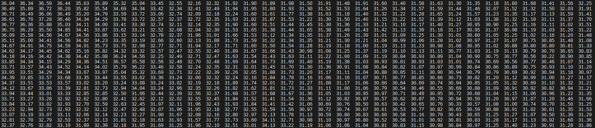

# MLX9064x C++ Acquisition

MLX90640 / MLX90641 열화상 센서를 I²C로 읽는 C++ 프로젝트입니다. 센서 API와 I²C 드라이버를 연결해 온도 데이터를 수집하며, OpenCV 영상 표시는 현재 구현 범위에 포함되지 않습니다.

## 구성

- [src/main.cpp](src/main.cpp): 실행 진입점
- [src/thermal_mlx9064x.cpp](src/thermal_mlx9064x.cpp): 센서 처리
- `src/MLX90640_API.cpp`, `src/MLX90641_API.cpp`: 센서 API
- `src/MLX9064X_I2C_Driver.cpp`: I²C 접근

## 빌드와 실행 조건

C++14, CMake 3.10 이상, Linux I²C 환경과 센서가 필요합니다. 사용할 센서 선택과 I²C 장치 접근 권한을 확인한 뒤 빌드합니다.

```bash
cmake -S . -B build-local
cmake --build build-local
```

실행 타깃 이름은 `thermal_mlx9064x`입니다. 센서 API 원본의 저작권·라이선스 표기를 유지하며, 하드웨어가 없는 환경에서 동작을 보장하지 않습니다.

<details>
<summary>기존 개발 기록 및 참고 자료</summary>

## MLX90640 Thermal Image Sensor for RPi4

### Developer : GH
### E-Mail : lsirikh@naver.com
### Release : 2024-09-24

<hr>

#### Using MLX90640 with RPI4 via I2C for Data Acquisition 

You can acquire data from MLX90640 through I2C on RPI4.  

1. I2C communication driver provided.  
2. Text-based data output example implemented.  
3. (Not yet implemented) Visualization using OpenCV.  

Sample image is located at `/pics/example.png`.



</details>
