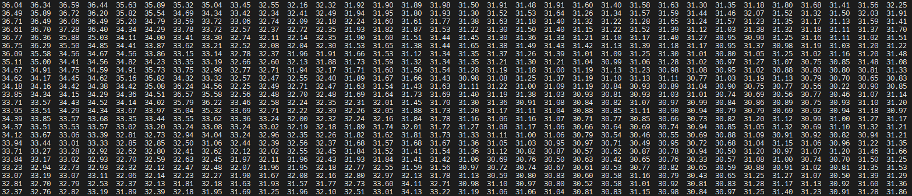

## MLX90640 Thermal Image Sensor for RPi4

### Developer : GH
### E-Mail : lsirikh@naver.com
### Release : 2024-09-24

#### Using MLX90640 with RPI4 via I2C for Data Acquisition 

You can acquire data from MLX90640 through I2C on RPI4.  

1. I2C communication driver provided.  
2. Text-based data output example implemented.  
3. (Not yet implemented) Visualization using OpenCV.  

Sample image is located at `/pics/example.png`.

